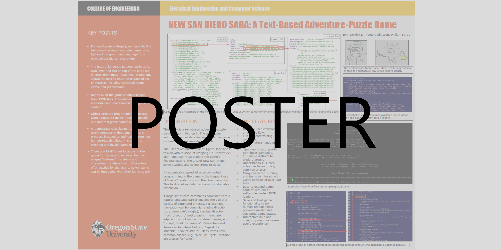
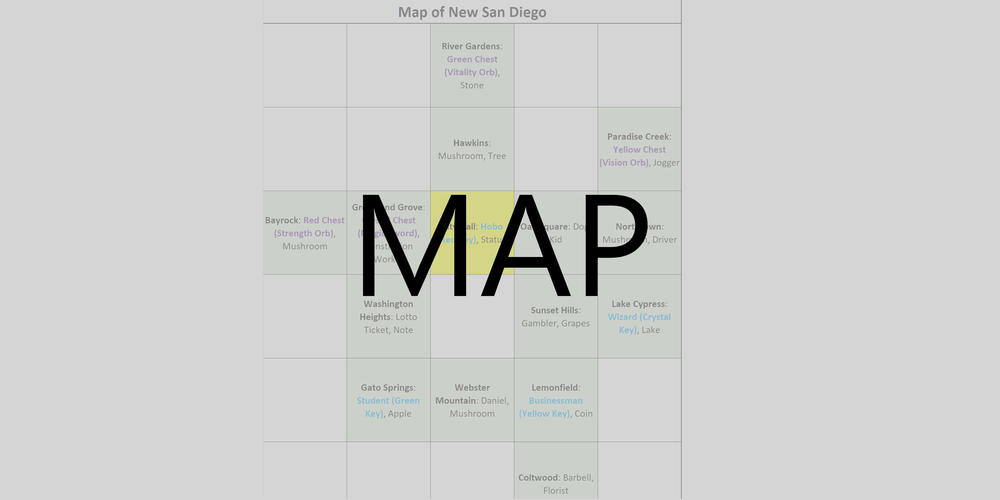

# Text-Based Adventure-Puzzle Game: NEW SAN DIEGO SAGA

NEW SAN DIEGO SAGA is a text-based adventure-puzzle game coded in Python 3. The objective of the game is to stop the game's antagonist, Dr. Crime, from poisoning the city of New San Diego. The game features an open-world setting with 15 different locations, filled with characters and items, to interact with. It also features save/load game options, and a limited natural language parser. A high-level overview of the code can be found in the [Poster](extra/poster.pdf). Spoiler Alert: [Map](extra/map.png) reveals some of the game's fun, so only view if you are really stuck. Enjoy!

## Instructions
Run `python3 main.py` to compile and run program.

## Additional Media

    
    

## Acknowledgements
Game created in collaboration with Hyoung Sik Won and William Fargo.

